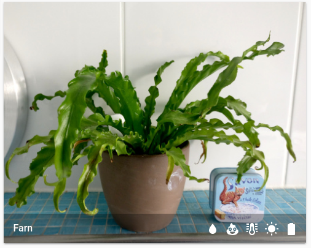

# picture-plant-card
A custom card for plant status with a picture in home assistant's lovelace ui

This custom card creates a nice and clean view for plant sensors. It relies on the [plant component][https://www.home-assistant.io/components/plant/], so you need to set this up before. However, the plant component creates an overall status for each plant (aka 'problem') which can be used on automations.

# Installation
Copy the file `picture-plant-card.js` to `<ha config dir>/www/picture-plant-card.js` in your home assistant's config subdirectory

Add it as a resource in your `lovelace-ui.yaml` like this:

```yaml
resources:
  - url: /local/picture-plant-card.js
    type: js
```

# Configuration
- **type** (_required_): custom:picture-plant-card
- **entity** (_required_): entity of the plant to be monitored
- **image** (_required_): picture of the plant, store images in `<ha config dir>/www` and reference them here as `/local/my_plant_img.jpg`
- **title** (_optional_): title of the card. If not specified the friendly name of the plant entity will be used.

## Sample:
```yaml
- type: custom:picture-plant-card
  entity: plant.fern
  title: Farn
  image: /local/plant_img/fern.jpg
```


